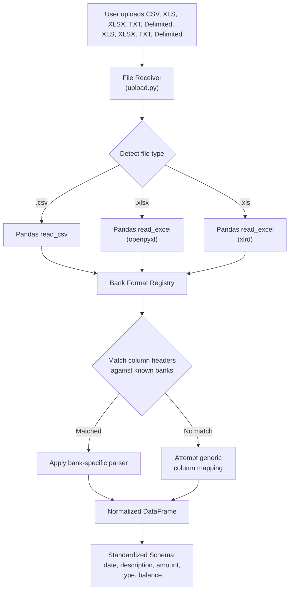
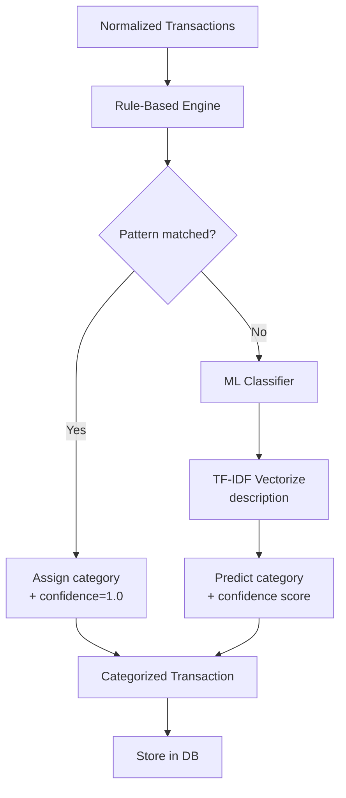
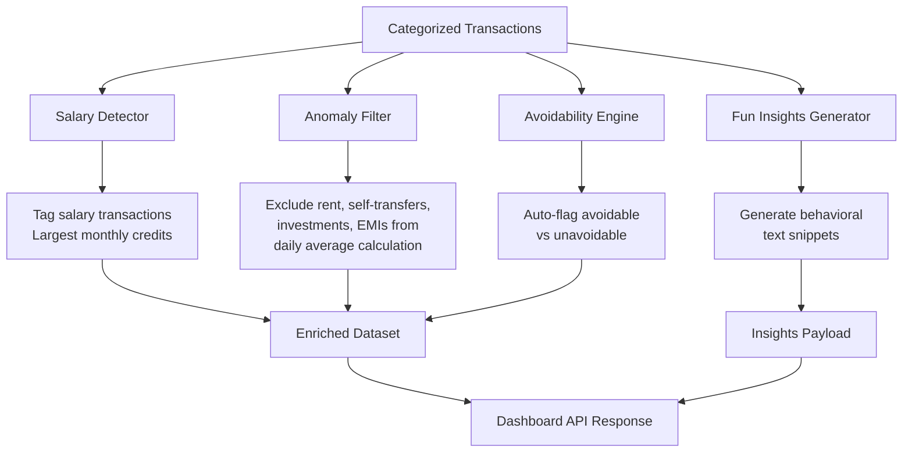
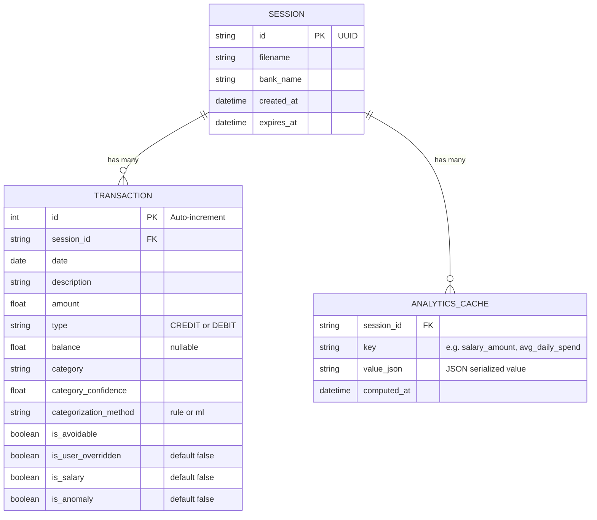
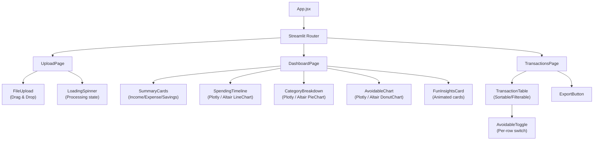
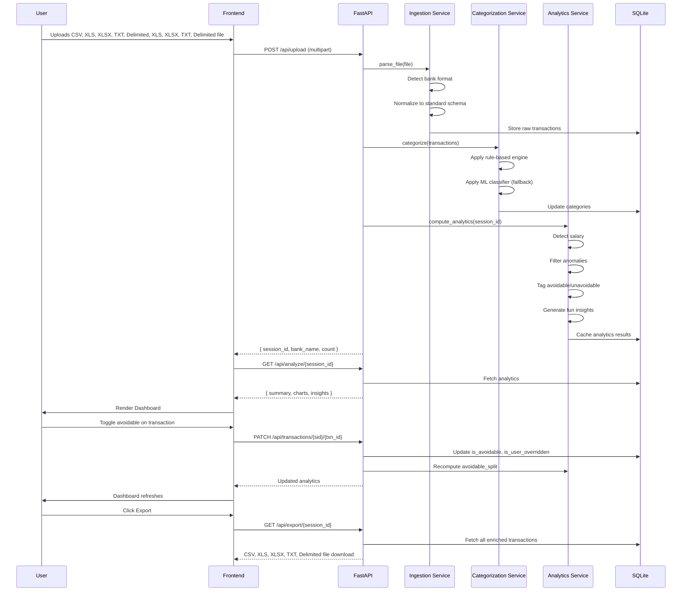
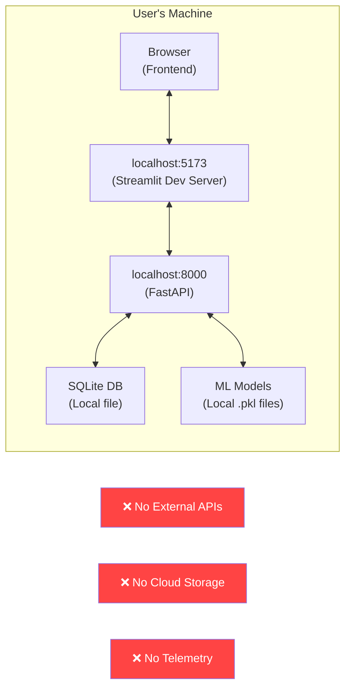
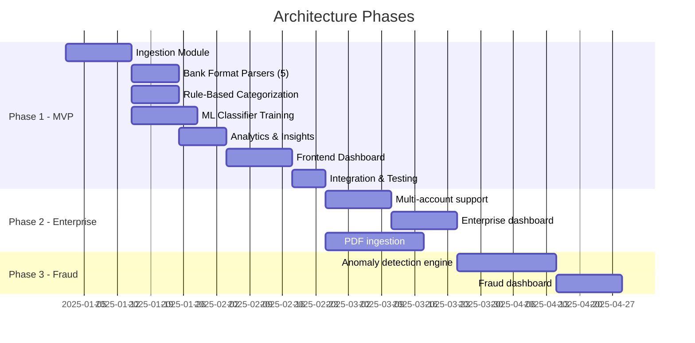

# Architecture: Privacy-First AI Bank Statement Analyzer

> Derived from [context.md](file:///c:/Users/aksha/Downloads/PMF/bank%20statement%20analyser/context.md)

---

## 1. Architecture Overview

The system follows a **layered, modular monorepo architecture** with a clear separation between the **Streamlit frontend**, **Python backend (FastAPI)**, and **local ML pipeline**. All processing is local — no data leaves the user's machine.

```
┌─────────────────────────────────────────────────────────────────────┐
│                        CLIENT LAYER                                 │
│                                                                     │
│   ┌───────────────┐  ┌──────────────┐  ┌────────────────────────┐  │
│   │  Upload View   │  │  Dashboard   │  │  Transaction Table     │  │
│   │  (Drag & Drop) │  │  (Charts)    │  │  (Toggle + Override)   │  │
│   └───────┬───────┘  └──────┬───────┘  └───────────┬────────────┘  │
│           │                 │                       │               │
│   ┌───────▼─────────────────▼───────────────────────▼───────────┐  │
│   │              Streamlit App (Streamlit)                               │  │
│   │   State Management: Streamlit Context / Streamlit Session State                 │  │
│   │   Charts: Plotly / Altair                                          │  │
│   │   HTTP Client: Axios / Fetch                                │  │
│   └──────────────────────────┬──────────────────────────────────┘  │
└──────────────────────────────┼──────────────────────────────────────┘
                               │  REST API (JSON over HTTP)
                               │  localhost:8000
┌──────────────────────────────▼──────────────────────────────────────┐
│                        API LAYER (FastAPI)                          │
│                                                                     │
│   ┌─────────────┐ ┌─────────────┐ ┌──────────────┐ ┌────────────┐ │
│   │ /upload     │ │ /analyze    │ │ /transactions│ │ /export    │ │
│   │ POST        │ │ GET         │ │ PATCH        │ │ GET        │ │
│   └──────┬──────┘ └──────┬──────┘ └──────┬───────┘ └─────┬──────┘ │
└──────────┼───────────────┼───────────────┼────────────────┼────────┘
           │               │               │                │
┌──────────▼───────────────▼───────────────▼────────────────▼────────┐
│                     SERVICE LAYER (Python)                          │
│                                                                     │
│   ┌──────────────┐  ┌───────────────┐  ┌────────────────────────┐  │
│   │  Ingestion   │  │Categorization │  │  Analytics & Insights  │  │
│   │  Service     │→ │  Service      │→ │  Service               │  │
│   └──────────────┘  └───────────────┘  └────────────────────────┘  │
│                                                                     │
│   ┌──────────────────────┐  ┌──────────────────────────────────┐   │
│   │  Enterprise Module   │  │  Fraud Detection Module          │   │
│   │  (Placeholder)       │  │  (Placeholder)                   │   │
│   └──────────────────────┘  └──────────────────────────────────┘   │
└──────────────────────────────┬──────────────────────────────────────┘
                               │
┌──────────────────────────────▼──────────────────────────────────────┐
│                       DATA LAYER                                    │
│                                                                     │
│   ┌───────────────┐  ┌─────────────────┐  ┌────────────────────┐   │
│   │ SQLite DB     │  │ ML Model Store  │  │  Bank Format       │   │
│   │ (sessions,    │  │ (pickled models,│  │  Registry          │   │
│   │  transactions)│  │  vectorizers)   │  │  (YAML/JSON defs)  │   │
│   └───────────────┘  └─────────────────┘  └────────────────────┘   │
│                                                                     │
│   All data stored locally — zero cloud dependency                   │
└─────────────────────────────────────────────────────────────────────┘
```

---

## 2. Technology Stack

### 2.1 Frontend

| Technology | Purpose | Version |
|---|---|---|
| **Streamlit** | Component-based UI framework | Latest |
| **Streamlit** | Build tool & dev server | Latest |
| **Plotly / Altair** | Interactive charts (time-series, pie, bar) | Latest |
| **Streamlit Session State** | Lightweight state management | Latest |
| **Axios** | HTTP client for API communication | Latest |
| **Streamlit Dropzone** | Drag-and-drop file upload | Latest |
| **Framer Motion** | Micro-animations & transitions | Latest |
| **Lucide Streamlit** | Icon set | Latest |

### 2.2 Backend

| Technology | Purpose | Version |
|---|---|---|
| **Python** | Core language | 3.11+ |
| **FastAPI** | REST API framework | Latest |
| **Uvicorn** | ASGI server | Latest |
| **Pandas** | Data manipulation & analysis | Latest |
| **openpyxl** | Excel file parsing (.xlsx) | Latest |
| **xlrd** | Legacy Excel parsing (.xls) | Latest |
| **scikit-learn** | ML classification (Naive Bayes / SVM) | Latest |
| **joblib** | Model serialization / loading | Latest |
| **SQLite** | Local persistent storage | Built-in |
| **SQLAlchemy** | ORM for SQLite (optional) | Latest |
| **Pydantic** | Data validation & serialization | Latest (v2) |

### 2.3 ML Pipeline

| Technology | Purpose |
|---|---|
| **scikit-learn TfidfVectorizer** | Text feature extraction from transaction descriptions |
| **scikit-learn MultinomialNB / LinearSVC** | Transaction category classification |
| **joblib** | Serialize trained models to disk |
| **re (stdlib)** | RegEx-based rule engine for UPI / known patterns |

---

## 3. Project Structure (Monorepo)

```
bank-statement-analyser/
│
├── frontend/                          # Streamlit + Streamlit frontend
│   ├── public/
│   ├── src/
│   │   ├── assets/                    # Static assets, fonts, images
│   │   ├── components/                # Reusable UI components
│   │   │   ├── upload/
│   │   │   │   └── FileUpload.jsx     # Drag-and-drop upload widget
│   │   │   ├── dashboard/
│   │   │   │   ├── SpendingTimeline.jsx    # Time-series spending chart
│   │   │   │   ├── CategoryBreakdown.jsx   # Category pie/bar chart
│   │   │   │   ├── AvoidableChart.jsx      # Avoidable vs unavoidable donut
│   │   │   │   ├── SummaryCards.jsx        # Income/expense/savings KPI cards
│   │   │   │   └── MonthlyTrend.jsx        # Multi-month comparison (if avail)
│   │   │   ├── insights/
│   │   │   │   └── FunInsightsCard.jsx     # Quirky behavioral fact snippets
│   │   │   ├── transactions/
│   │   │   │   ├── TransactionTable.jsx    # Searchable, sortable table
│   │   │   │   └── AvoidableToggle.jsx     # Toggle switch per row
│   │   │   └── common/
│   │   │       ├── Navbar.jsx
│   │   │       ├── Sidebar.jsx
│   │   │       ├── LoadingSpinner.jsx
│   │   │       └── ExportButton.jsx
│   │   ├── pages/
│   │   │   ├── UploadPage.jsx         # Landing — file upload
│   │   │   ├── DashboardPage.jsx      # Main analytics dashboard
│   │   │   └── TransactionsPage.jsx   # Full transaction list + overrides
│   │   ├── hooks/
│   │   │   ├── useFileUpload.js       # Upload logic & progress state
│   │   │   └── useAnalytics.js        # Fetch & cache analytics data
│   │   ├── store/
│   │   │   └── useAppStore.js         # Streamlit Session State global state
│   │   ├── services/
│   │   │   └── api.js                 # Axios instance & API call wrappers
│   │   ├── utils/
│   │   │   ├── formatters.js          # Currency, date formatters
│   │   │   └── constants.js           # Category colors, labels
│   │   ├── styles/
│   │   │   ├── index.css              # Global styles, design tokens
│   │   │   ├── variables.css          # CSS custom properties
│   │   │   └── animations.css         # Keyframe animations
│   │   ├── App.jsx
│   │   └── main.jsx
│   ├── index.html
│   ├── vite.config.js
│   └── package.json
│
├── backend/                           # Python FastAPI backend
│   ├── app/
│   │   ├── __init__.py
│   │   ├── main.py                    # FastAPI app entry, CORS, lifespan
│   │   ├── config.py                  # App configuration & constants
│   │   │
│   │   ├── api/                       # API route handlers
│   │   │   ├── __init__.py
│   │   │   ├── upload.py              # POST /api/upload
│   │   │   ├── analyze.py             # GET  /api/analyze/{session_id}
│   │   │   ├── transactions.py        # GET/PATCH /api/transactions/{session_id}
│   │   │   └── export.py              # GET  /api/export/{session_id}
│   │   │
│   │   ├── services/                  # Core business logic
│   │   │   ├── __init__.py
│   │   │   ├── ingestion.py           # File parsing, bank detection, normalization
│   │   │   ├── categorization.py      # Rule-based + ML categorization pipeline
│   │   │   ├── analytics.py           # Salary detection, anomaly filtering, insights
│   │   │   ├── avoidability.py        # Avoidable/unavoidable tagging engine
│   │   │   └── export_service.py      # CSV, XLS, XLSX, TXT, Delimited export generation
│   │   │
│   │   ├── ml/                        # Machine Learning module
│   │   │   ├── __init__.py
│   │   │   ├── model.py               # Model loading, prediction interface
│   │   │   ├── trainer.py             # Training script (offline, one-time)
│   │   │   └── preprocessor.py        # Text cleaning, tokenization for ML
│   │   │
│   │   ├── bank_formats/              # Bank format registry
│   │   │   ├── __init__.py
│   │   │   ├── registry.py            # Auto-detection logic + format loader
│   │   │   ├── base.py                # Abstract base parser class
│   │   │   ├── hdfc.py                # HDFC format parser
│   │   │   ├── sbi.py                 # SBI format parser
│   │   │   ├── icici.py               # ICICI format parser
│   │   │   ├── axis.py                # Axis format parser
│   │   │   └── kotak.py               # Kotak format parser
│   │   │
│   │   ├── rules/                     # Rule-based categorization rules
│   │   │   ├── __init__.py
│   │   │   ├── upi_parser.py          # UPI format regex extractor
│   │   │   ├── merchant_dict.py       # Known merchant → category mapping
│   │   │   └── patterns.py            # ATM, NEFT, RTGS, IMPS, EMI patterns
│   │   │
│   │   ├── models/                    # Data models (Pydantic / SQLAlchemy)
│   │   │   ├── __init__.py
│   │   │   ├── schemas.py             # Pydantic request/response schemas
│   │   │   └── db_models.py           # SQLAlchemy ORM models
│   │   │
│   │   ├── db/                        # Database layer
│   │   │   ├── __init__.py
│   │   │   ├── database.py            # SQLite connection & session management
│   │   │   └── migrations.py          # Schema creation / migration helpers
│   │   │
│   │   └── placeholders/              # Future phase stubs
│   │       ├── __init__.py
│   │       ├── enterprise.py          # Enterprise analysis placeholder
│   │       └── fraud.py               # Fraud detection placeholder
│   │
│   ├── ml_models/                     # Serialized ML model artifacts
│   │   ├── category_classifier.pkl    # Trained classifier
│   │   └── tfidf_vectorizer.pkl       # Fitted TF-IDF vectorizer
│   │
│   ├── data/                          # Local data directory
│   │   ├── uploads/                   # Temp uploaded files
│   │   ├── training/                  # Training datasets (labeled CSVs)
│   │   └── bank_statement.db          # SQLite database file
│   │
│   ├── tests/                         # Unit & integration tests
│   │   ├── test_ingestion.py
│   │   ├── test_categorization.py
│   │   ├── test_analytics.py
│   │   └── test_api.py
│   │
│   ├── requirements.txt
│   └── pyproject.toml
│
├── docs/                              # Project documentation
│   ├── context.md
│   └── architecture.md                # ← This file
│
├── .gitignore
└── README.md
```

---

## 4. Detailed Module Architecture

### 4.1 Data Ingestion Module



#### Bank Format Registry — Strategy Pattern

Each bank parser implements a common interface:

```python
# backend/app/bank_formats/base.py

from abc import ABC, abstractmethod
import pandas as pd

class BaseBankParser(ABC):
    """Abstract base class for all bank format parsers."""

    @abstractmethod
    def detect(self, df: pd.DataFrame) -> float:
        """Return confidence score (0.0 - 1.0) that this format matches."""
        pass

    @abstractmethod
    def normalize(self, df: pd.DataFrame) -> pd.DataFrame:
        """Transform bank-specific columns to standard schema."""
        pass

    @property
    @abstractmethod
    def bank_name(self) -> str:
        """Human-readable bank name."""
        pass
```

The **registry** iterates all registered parsers, calls `detect()` on each, and selects the parser with the highest confidence score:

```python
# backend/app/bank_formats/registry.py

class BankFormatRegistry:
    def __init__(self):
        self._parsers: list[BaseBankParser] = []

    def register(self, parser: BaseBankParser):
        self._parsers.append(parser)

    def detect_and_parse(self, df: pd.DataFrame) -> tuple[str, pd.DataFrame]:
        best_parser = max(self._parsers, key=lambda p: p.detect(df))
        if best_parser.detect(df) < 0.5:
            raise UnknownBankFormatError("Could not identify bank format")
        return best_parser.bank_name, best_parser.normalize(df)
```

#### Standard Internal Schema

| Column | Type | Source Mapping |
|---|---|---|
| `date` | `datetime64` | Parsed from bank-specific date column |
| `description` | `str` | Raw narration / transaction remarks |
| `amount` | `float64` | Absolute transaction value |
| `type` | `str` enum (`CREDIT` / `DEBIT`) | Derived from debit/credit columns or sign |
| `balance` | `float64` (nullable) | Closing balance if available |

---

### 4.2 Categorization Engine



#### Layer 1: Rule-Based Engine (Priority)

```python
# Execution order (first match wins):
# 1. UPI Parser     → Extract payee from UPI string, match against merchant dict
# 2. Pattern Rules  → ATM/NEFT/RTGS/IMPS/EMI regex patterns
# 3. Merchant Dict  → Keyword search in description → category
```

**UPI Parser example:**
```python
import re

UPI_PATTERN = re.compile(
    r'UPI[-/](?P<payee>[^/]+?)(?:@[a-z]+)?[-/]',
    re.IGNORECASE
)

def extract_upi_payee(description: str) -> str | None:
    match = UPI_PATTERN.search(description)
    return match.group('payee').strip() if match else None
```

**Merchant Dictionary example:**
```python
MERCHANT_CATEGORIES = {
    "Food": ["swiggy", "zomato", "dominos", "mcdonalds", "starbucks", "restaurant"],
    "Entertainment": ["netflix", "hotstar", "prime video", "bookmyshow", "spotify"],
    "Transport": ["uber", "ola", "rapido", "metro", "irctc", "petrol", "fuel"],
    "Shopping": ["amazon", "flipkart", "myntra", "ajio", "meesho"],
    "Utilities": ["electricity", "broadband", "jio", "airtel", "vodafone", "water"],
    # ...
}
```

#### Layer 2: ML Classifier (Fallback)

- **Algorithm:** `MultinomialNB` or `LinearSVC` (scikit-learn)
- **Features:** TF-IDF vectors of cleaned transaction descriptions
- **Training:** Offline, one-time training on labeled dataset of Indian bank transactions
- **Output:** Predicted category + confidence score
- **Model artifacts:** Stored in `backend/ml_models/` as `.pkl` files

```python
# backend/app/ml/model.py

class CategoryClassifier:
    def __init__(self, model_path: str, vectorizer_path: str):
        self.model = joblib.load(model_path)
        self.vectorizer = joblib.load(vectorizer_path)

    def predict(self, description: str) -> tuple[str, float]:
        features = self.vectorizer.transform([description])
        category = self.model.predict(features)[0]
        confidence = max(self.model.predict_proba(features)[0])
        return category, confidence
```

---

### 4.3 Analytics & Insights Service



#### Salary Auto-Detection Algorithm

```python
def detect_salary(transactions: pd.DataFrame) -> pd.DataFrame:
    """
    Identify salary by finding the largest recurring monthly credit(s).
    Heuristics:
      1. Filter CREDIT transactions
      2. Group by month
      3. For each month, find the top-N largest credits
      4. If a similar amount appears across 2+ months → high confidence salary
      5. Tag matching transactions as 'Salary/Income'
    """
```

#### Avoidability Rules

| Category | Default Flag | Rationale |
|---|---|---|
| Food | Avoidable | Discretionary dining/delivery |
| Entertainment | Avoidable | Non-essential spending |
| Shopping | Avoidable | Impulse / discretionary purchases |
| Transport | Avoidable | Mixed — can be overridden |
| Rent | Unavoidable | Fixed monthly obligation |
| Utilities | Unavoidable | Essential services |
| EMI/Loans | Unavoidable | Contractual obligation |
| Investments | Unavoidable | Savings (excluded from spend) |
| Self-Transfers | Unavoidable | Not real expenditure |
| Salary/Income | N/A | Income, not expense |
| Others | Avoidable | Default — user can override |

#### Fun Insights — Pattern Detectors

| Insight Type | Detection Logic |
|---|---|
| Most common amount | `mode()` of transaction amounts |
| Top spending day of week | Group by `day_of_week`, sum amounts |
| Peak spending date | Group by `day_of_month`, find max |
| Salary allocation ratio | `(rent + investments) / salary * 100` |
| Category streaks | Consecutive days with same-category spending |
| Weekend vs weekday | Compare avg spending on weekends vs weekdays |
| Largest single transaction | `max()` of debit amounts |

---

### 4.4 Database Schema (SQLite)



---

## 5. API Design

### 5.1 Endpoints

| Method | Endpoint | Description | Request | Response |
|---|---|---|---|---|
| `POST` | `/api/upload` | Upload bank statement file | `multipart/form-data` (file) | `{ session_id, bank_name, transaction_count }` |
| `GET` | `/api/analyze/{session_id}` | Get full analytics dashboard data | — | `{ summary, charts, insights }` |
| `GET` | `/api/transactions/{session_id}` | Get paginated transaction list | `?page=1&size=50&category=Food` | `{ transactions[], total, page }` |
| `PATCH` | `/api/transactions/{session_id}/{txn_id}` | Override avoidable flag | `{ is_avoidable: bool }` | `{ updated_transaction }` |
| `GET` | `/api/export/{session_id}` | Download enriched CSV, XLS, XLSX, TXT, Delimited | — | CSV, XLS, XLSX, TXT, Delimited file download |
| `GET` | `/api/categories` | List all categories | — | `{ categories[] }` |

### 5.2 Response Schemas

#### Upload Response
```json
{
  "session_id": "a1b2c3d4-e5f6-...",
  "bank_name": "HDFC",
  "transaction_count": 142,
  "date_range": {
    "start": "2025-06-01",
    "end": "2025-06-30"
  },
  "status": "analyzed"
}
```

#### Analytics Response
```json
{
  "summary": {
    "total_income": 85000.00,
    "total_expense": 62340.50,
    "net_savings": 22659.50,
    "savings_rate": 26.66,
    "avg_daily_spend": 1245.80,
    "detected_salary": 75000.00,
    "transaction_count": 142
  },
  "category_breakdown": [
    { "category": "Food", "amount": 12500.00, "count": 38, "percentage": 20.05 },
    { "category": "Rent", "amount": 18000.00, "count": 1, "percentage": 28.87 }
  ],
  "avoidable_split": {
    "avoidable": 28500.00,
    "unavoidable": 33840.50
  },
  "daily_spending": [
    { "date": "2025-06-01", "amount": 1520.00 },
    { "date": "2025-06-02", "amount": 890.00 }
  ],
  "insights": [
    { "emoji": "💸", "text": "₹850 is your most common transaction amount this month!" },
    { "emoji": "🍕", "text": "You spent on Food the most on Sundays!" },
    { "emoji": "📅", "text": "On the 8th of the month you spent the most." }
  ]
}
```

#### Transaction Object
```json
{
  "id": 1,
  "date": "2025-06-01",
  "description": "UPI/swiggy@axisbank/TXN123456",
  "amount": 450.00,
  "type": "DEBIT",
  "balance": 34550.00,
  "category": "Food",
  "category_confidence": 0.95,
  "categorization_method": "rule",
  "is_avoidable": true,
  "is_user_overridden": false,
  "is_salary": false
}
```

---

## 6. Frontend Architecture

### 6.1 Component Tree



### 6.2 State Management (Streamlit Session State)

```javascript
// store/useAppStore.js

const useAppStore = create((set) => ({
  // Session
  sessionId: null,
  bankName: null,

  // Upload state
  isUploading: false,
  uploadProgress: 0,

  // Analytics data
  summary: null,
  categoryBreakdown: [],
  dailySpending: [],
  avoidableSplit: null,
  insights: [],

  // Transactions
  transactions: [],
  totalTransactions: 0,
  currentPage: 1,
  filters: { category: null, type: null, avoidable: null },

  // Actions
  setSession: (id, bank) => set({ sessionId: id, bankName: bank }),
  setAnalytics: (data) => set({ ...data }),
  updateTransaction: (id, updates) => set((state) => ({
    transactions: state.transactions.map(t =>
      t.id === id ? { ...t, ...updates } : t
    )
  })),
}));
```

### 6.3 Page Routing

| Route | Page | Purpose |
|---|---|---|
| `/` | `UploadPage` | Landing page with drag-and-drop upload |
| `/dashboard` | `DashboardPage` | Full analytics dashboard with charts |
| `/transactions` | `TransactionsPage` | Transaction list with category filters & toggles |

---

## 7. Data Flow — End to End



---

## 8. Key Design Patterns

### 8.1 Strategy Pattern — Bank Parsers

Each bank format is a self-contained strategy implementing `BaseBankParser`. New banks are added by:
1. Creating a new file in `backend/app/bank_formats/`
2. Implementing `detect()` and `normalize()`
3. Registering with the `BankFormatRegistry`

No changes to core ingestion logic required.

### 8.2 Pipeline Pattern — Categorization

Transactions flow through an ordered pipeline:
```
Raw Description → UPI Parser → Pattern Rules → Merchant Dict → ML Classifier → Category
```
First match wins. Each stage can either assign a category or pass through to the next.

### 8.3 Observer Pattern — Dashboard Streamlitivity

When a user toggles the avoidable flag on a transaction:
1. `PATCH` API updates the DB
2. Backend recomputes affected analytics (avoidable split, insights)
3. Frontend receives updated analytics and re-renders affected charts

### 8.4 Session Pattern — Data Isolation

Each file upload creates a new **session** (UUID). All transactions and analytics are scoped to a session. Sessions can expire and be cleaned up automatically.

---

## 9. Privacy & Security Architecture



| Principle | Implementation |
|---|---|
| **No external API calls** | ML models are loaded from local `.pkl` files; no HTTP calls to OpenAI/Groq/etc. |
| **No cloud storage** | SQLite DB stored on local filesystem; uploads are temp files deleted after processing. |
| **No telemetry** | No analytics SDKs, no tracking pixels, no error reporting to external services. |
| **Session isolation** | Each upload creates an isolated session; no cross-user data leakage. |
| **Data expiry** | Sessions auto-expire after configurable duration (default: 24 hours). |
| **CORS restricted** | FastAPI CORS allows only `localhost` origins. |

---

## 10. Extensibility Points

| Extension Point | How to Extend | Example |
|---|---|---|
| **New bank format** | Add a new parser class in `bank_formats/`, implement `detect()` + `normalize()`, register it | Adding Yes Bank support |
| **New spending category** | Add to `MERCHANT_CATEGORIES` dict + retrain ML model | Adding "Healthcare" category |
| **New insight type** | Add a detector function in `analytics.py`, return new insight text | "You made 12 transactions under ₹100 this month" |
| **Enterprise module** | Implement `placeholders/enterprise.py` with multi-account logic | Cross-account cash flow |
| **Fraud detection** | Implement `placeholders/fraud.py` with anomaly detection algorithms | Micro-transaction clustering |
| **PDF ingestion** | Add PDF parser using `pdfplumber` / `camelot` in ingestion service | Future Phase 2+ |

---

## 11. Performance Considerations

| Area | Strategy |
|---|---|
| **File parsing** | Pandas chunked reading for large files (>50K rows) |
| **ML inference** | Model loaded once at server startup, reused across requests |
| **Analytics computation** | Results cached in `ANALYTICS_CACHE` table; recomputed only on toggle changes |
| **Frontend rendering** | Virtualized table for large transaction lists (react-window) |
| **API responses** | Paginated transaction endpoints (default 50/page) |
| **Session cleanup** | Background task to delete expired sessions and temp files |

---

## 12. Development & Deployment

### Local Development

```bash
# Backend
cd backend
python -m venv venv
source venv/bin/activate        # Windows: venv\Scripts\activate
pip install -r requirements.txt
uvicorn app.main:app --reload --port 8000

# Frontend
cd frontend
npm install
npm run dev                     # Starts on localhost:5173
```

### Environment Variables

```env
# backend/.env
DATABASE_URL=sqlite:///./data/bank_statement.db
UPLOAD_DIR=./data/uploads
ML_MODEL_PATH=./ml_models/category_classifier.pkl
ML_VECTORIZER_PATH=./ml_models/tfidf_vectorizer.pkl
SESSION_EXPIRY_HOURS=24
MAX_UPLOAD_SIZE_MB=50
CORS_ORIGINS=http://localhost:5173
```

### Testing

```bash
# Backend unit tests
cd backend
pytest tests/ -v

# Frontend (if tests added)
cd frontend
npm run test
```

---

## 13. Phase Roadmap (Architecture Perspective)


