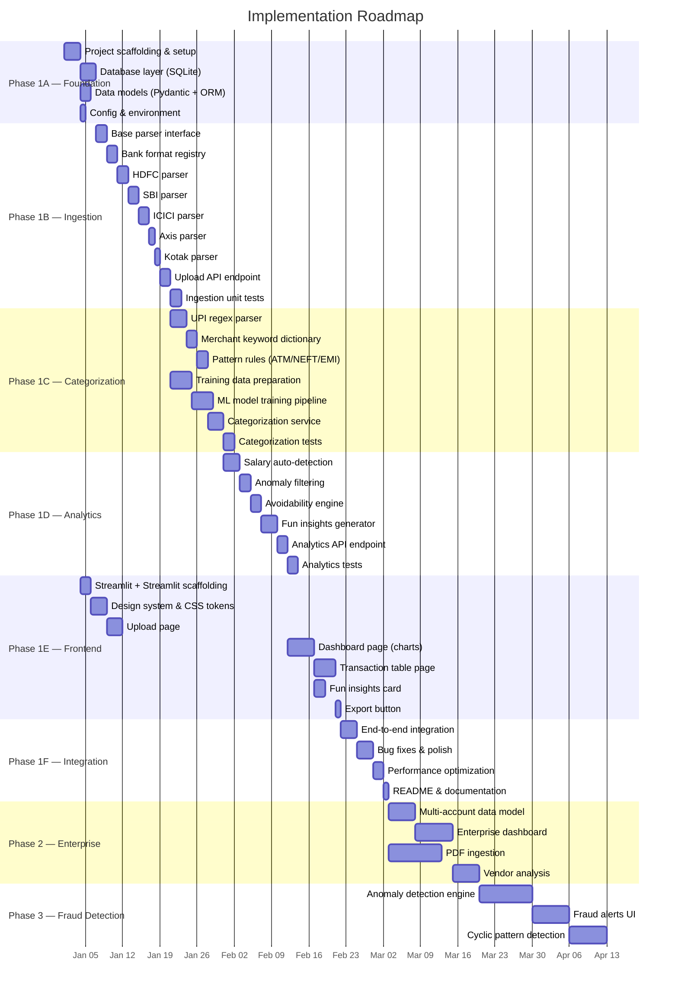
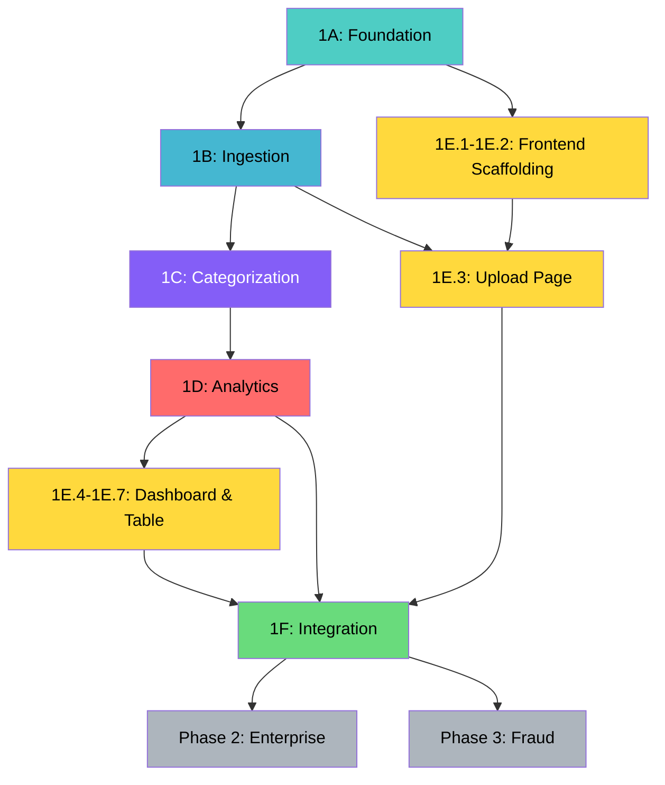

# Implementation Plan: Privacy-First AI Bank Statement Analyzer

> Phase-wise implementation guide derived from [architecture.md](file:///c:/Users/aksha/Downloads/PMF/bank%20statement%20analyser/architecture.md)

---

## Phase Overview



---

## Phase 1A — Project Foundation

**Goal:** Set up the monorepo structure, database layer, data models, and configuration so all subsequent modules have a solid foundation to build on.

**Duration:** ~4 days

---

### Step 1A.1 — Project Scaffolding

**Files to create:**

| File | Purpose |
|---|---|
| `README.md` | Project overview, setup instructions |
| `.gitignore` | Ignore venv, node_modules, .db, .pkl, uploads, __pycache__ |
| `backend/requirements.txt` | Python dependencies |
| `backend/pyproject.toml` | Python project metadata |
| `backend/app/__init__.py` | Package init |
| `backend/app/main.py` | FastAPI app entry point |
| `backend/app/config.py` | Configuration loader |

**Actions:**

1. Initialize git repository at project root.
2. Create `backend/` directory structure as per architecture.
3. Create `frontend/` via Streamlit:
   ```bash
   cd frontend
   npx -y create-vite@latest ./ --template react
   npm install
   ```
4. Create empty `__init__.py` files in all Python sub-packages:
   - `app/api/`, `app/services/`, `app/ml/`, `app/bank_formats/`, `app/rules/`, `app/models/`, `app/db/`, `app/placeholders/`
5. Create `backend/data/uploads/` and `backend/data/training/` directories.
6. Create `backend/ml_models/` directory.

**`backend/requirements.txt`:**
```
fastapi>=0.104.0
uvicorn[standard]>=0.24.0
pandas>=2.1.0
openpyxl>=3.1.0
xlrd>=2.0.0
scikit-learn>=1.3.0
joblib>=1.3.0
sqlalchemy>=2.0.0
pydantic>=2.5.0
python-multipart>=0.0.6
python-dotenv>=1.0.0
```

**`backend/app/main.py` skeleton:**
```python
from fastapi import FastAPI
from fastapi.middleware.cors import CORSMiddleware
from contextlib import asynccontextmanager
from app.config import settings
from app.db.database import init_db

@asynccontextmanager
async def lifespan(app: FastAPI):
    # Startup: init DB, load ML model
    init_db()
    yield
    # Shutdown: cleanup

app = FastAPI(
    title="Bank Statement Analyzer",
    version="1.0.0",
    lifespan=lifespan
)

app.add_middleware(
    CORSMiddleware,
    allow_origins=[settings.CORS_ORIGINS],
    allow_methods=["*"],
    allow_headers=["*"],
)

# Register routers
# app.include_router(upload_router, prefix="/api")
# app.include_router(analyze_router, prefix="/api")
# app.include_router(transactions_router, prefix="/api")
# app.include_router(export_router, prefix="/api")
```

**`backend/app/config.py`:**
```python
from pydantic_settings import BaseSettings

class Settings(BaseSettings):
    DATABASE_URL: str = "sqlite:///./data/bank_statement.db"
    UPLOAD_DIR: str = "./data/uploads"
    ML_MODEL_PATH: str = "./ml_models/category_classifier.pkl"
    ML_VECTORIZER_PATH: str = "./ml_models/tfidf_vectorizer.pkl"
    SESSION_EXPIRY_HOURS: int = 24
    MAX_UPLOAD_SIZE_MB: int = 50
    CORS_ORIGINS: str = "http://localhost:5173"

    class Config:
        env_file = ".env"

settings = Settings()
```

**Verification:**
```bash
cd backend
pip install -r requirements.txt
uvicorn app.main:app --reload --port 8000
# Verify: GET http://localhost:8000/docs returns Swagger UI
```

---

### Step 1A.2 — Database Layer (SQLite + SQLAlchemy)

**Files to create:**

| File | Purpose |
|---|---|
| `backend/app/db/database.py` | Engine, session factory, init_db() |
| `backend/app/db/migrations.py` | create_all() for schema setup |

**`backend/app/db/database.py`:**
```python
from sqlalchemy import create_engine
from sqlalchemy.orm import sessionmaker, DeclarativeBase
from app.config import settings

engine = create_engine(settings.DATABASE_URL, connect_args={"check_same_thread": False})
SessionLocal = sessionmaker(autocommit=False, autoflush=False, bind=engine)

class Base(DeclarativeBase):
    pass

def get_db():
    db = SessionLocal()
    try:
        yield db
    finally:
        db.close()

def init_db():
    from app.models.db_models import Session, Transaction, AnalyticsCache  # noqa
    Base.metadata.create_all(bind=engine)
```

**Verification:**
- Server starts without errors.
- `data/bank_statement.db` file is created on startup.
- Tables `sessions`, `transactions`, `analytics_cache` exist (inspect with `sqlite3` CLI).

---

### Step 1A.3 — Data Models (Pydantic + SQLAlchemy ORM)

**Files to create:**

| File | Purpose |
|---|---|
| `backend/app/models/schemas.py` | Pydantic request/response schemas |
| `backend/app/models/db_models.py` | SQLAlchemy ORM table definitions |

**`backend/app/models/db_models.py` — Tables:**

```python
# SESSION table
class SessionModel(Base):
    __tablename__ = "sessions"
    id          = Column(String, primary_key=True)        # UUID
    filename    = Column(String, nullable=False)
    bank_name   = Column(String, nullable=True)
    created_at  = Column(DateTime, default=datetime.utcnow)
    expires_at  = Column(DateTime)
    transactions = relationship("TransactionModel", back_populates="session")

# TRANSACTION table
class TransactionModel(Base):
    __tablename__ = "transactions"
    id                     = Column(Integer, primary_key=True, autoincrement=True)
    session_id             = Column(String, ForeignKey("sessions.id"))
    date                   = Column(Date, nullable=False)
    description            = Column(String, nullable=False)
    amount                 = Column(Float, nullable=False)
    type                   = Column(String, nullable=False)          # CREDIT / DEBIT
    balance                = Column(Float, nullable=True)
    category               = Column(String, nullable=True)
    category_confidence    = Column(Float, nullable=True)
    categorization_method  = Column(String, nullable=True)           # rule / ml
    is_avoidable           = Column(Boolean, default=True)
    is_user_overridden     = Column(Boolean, default=False)
    is_salary              = Column(Boolean, default=False)
    is_anomaly             = Column(Boolean, default=False)
    session                = relationship("SessionModel", back_populates="transactions")

# ANALYTICS_CACHE table
class AnalyticsCacheModel(Base):
    __tablename__ = "analytics_cache"
    id          = Column(Integer, primary_key=True, autoincrement=True)
    session_id  = Column(String, ForeignKey("sessions.id"))
    key         = Column(String, nullable=False)
    value_json  = Column(String, nullable=False)
    computed_at = Column(DateTime, default=datetime.utcnow)
```

**`backend/app/models/schemas.py` — Key schemas:**

```python
class UploadResponse(BaseModel):
    session_id: str
    bank_name: str
    transaction_count: int
    date_range: DateRange
    status: str

class AnalyticsResponse(BaseModel):
    summary: Summary
    category_breakdown: list[CategoryBreakdownItem]
    avoidable_split: AvoidableSplit
    daily_spending: list[DailySpending]
    insights: list[Insight]

class TransactionResponse(BaseModel):
    id: int
    date: date
    description: str
    amount: float
    type: str
    balance: float | None
    category: str | None
    category_confidence: float | None
    categorization_method: str | None
    is_avoidable: bool
    is_user_overridden: bool
    is_salary: bool

class TransactionUpdateRequest(BaseModel):
    is_avoidable: bool
```

**Verification:**
- Import all models in Python shell — no errors.
- `init_db()` creates all tables.
- Unit test: insert a session + transactions, query them back.

---

## Phase 1B — Data Ingestion Module

**Goal:** Build the file upload endpoint, auto-detect bank format, parse CSV, XLS, XLSX, TXT, Delimited, XLS, XLSX, TXT, Delimited files, and normalize transactions into the standard schema.

**Duration:** ~12 days

---

### Step 1B.1 — Base Parser Interface

**File:** `backend/app/bank_formats/base.py`

```python
from abc import ABC, abstractmethod
import pandas as pd

class BaseBankParser(ABC):
    @abstractmethod
    def detect(self, df: pd.DataFrame) -> float:
        """Return confidence 0.0-1.0 that this DataFrame matches this bank format."""
        pass

    @abstractmethod
    def normalize(self, df: pd.DataFrame) -> pd.DataFrame:
        """Return DataFrame with columns: date, description, amount, type, balance."""
        pass

    @property
    @abstractmethod
    def bank_name(self) -> str:
        pass
```

### Step 1B.2 — Bank Format Registry

**File:** `backend/app/bank_formats/registry.py`

Implements:
- `register(parser)` — add a parser to the registry
- `detect_and_parse(df)` — iterate all parsers, call `detect()`, pick highest confidence, call `normalize()`
- `UnknownBankFormatError` — raised when no parser scores above threshold (0.5)

Auto-registers all built-in parsers on import.

### Step 1B.3 → 1B.7 — Bank-Specific Parsers

Create one parser per bank. Each implements `detect()` and `normalize()`.

| Step | File | Bank | Key Column Headers to Match |
|---|---|---|---|
| 1B.3 | `hdfc.py` | HDFC | `Date`, `Narration`, `Withdrawal Amt`, `Deposit Amt`, `Closing Balance` |
| 1B.4 | `sbi.py` | SBI | `Txn Date`, `Description`, `Debit`, `Credit`, `Balance` |
| 1B.5 | `icici.py` | ICICI | `Transaction Date`, `Transaction Remarks`, `Withdrawal Amount`, `Deposit Amount` |
| 1B.6 | `axis.py` | Axis | `Tran Date`, `PARTICULARS`, `DR`, `CR`, `BAL` |
| 1B.7 | `kotak.py` | Kotak | `Date`, `Description`, `Debit`, `Credit`, `Balance` |

**`detect()` logic pattern** (example for HDFC):
```python
def detect(self, df: pd.DataFrame) -> float:
    expected_cols = {"date", "narration", "withdrawal amt", "deposit amt", "closing balance"}
    actual_cols = {c.strip().lower() for c in df.columns}
    overlap = len(expected_cols & actual_cols)
    return overlap / len(expected_cols)  # 1.0 = perfect match
```

**`normalize()` logic pattern:**
```python
def normalize(self, df: pd.DataFrame) -> pd.DataFrame:
    result = pd.DataFrame()
    result["date"] = pd.to_datetime(df["Date"], dayfirst=True)
    result["description"] = df["Narration"].astype(str)
    result["amount"] = df["Withdrawal Amt"].fillna(0) + df["Deposit Amt"].fillna(0)
    result["type"] = df.apply(
        lambda r: "DEBIT" if pd.notna(r["Withdrawal Amt"]) and r["Withdrawal Amt"] > 0
        else "CREDIT", axis=1
    )
    result["balance"] = pd.to_numeric(df["Closing Balance"], errors="coerce")
    return result.dropna(subset=["date", "description"])
```

### Step 1B.8 — Upload API Endpoint

**File:** `backend/app/api/upload.py`

**Endpoint:** `POST /api/upload`

**Flow:**
1. Accept multipart file upload.
2. Validate file extension (`.csv`, `.xls`, `.xlsx`).
3. Validate file size (≤ `MAX_UPLOAD_SIZE_MB`).
4. Save to `UPLOAD_DIR` temporarily.
5. Read into Pandas DataFrame.
6. Call `BankFormatRegistry.detect_and_parse(df)`.
7. Create `Session` in DB (UUID, filename, bank_name).
8. Insert normalized transactions into DB.
9. Trigger categorization pipeline (Step 1C).
10. Return `UploadResponse`.

**File:** `backend/app/services/ingestion.py`

Core service function:
```python
def process_upload(file_path: str, filename: str, db: Session) -> UploadResponse:
    df = read_file(file_path)            # Step 5
    bank_name, normalized = registry.detect_and_parse(df)  # Step 6
    session = create_session(db, filename, bank_name)       # Step 7
    insert_transactions(db, session.id, normalized)          # Step 8
    categorize_all(db, session.id)                           # Step 9 (calls Phase 1C)
    compute_analytics(db, session.id)                        # Step 9 (calls Phase 1D)
    return build_response(session, normalized)               # Step 10
```

### Step 1B.9 — Ingestion Unit Tests

**File:** `backend/tests/test_ingestion.py`

| Test Case | Description |
|---|---|
| `test_hdfc_detection` | Load sample HDFC CSV, XLS, XLSX, TXT, Delimited → detect returns confidence > 0.8 |
| `test_sbi_detection` | Load sample SBI CSV, XLS, XLSX, TXT, Delimited → detect returns confidence > 0.8 |
| `test_normalization_schema` | Normalized DataFrame has exactly 5 columns with correct types |
| `test_unknown_format_error` | Random CSV, XLS, XLSX, TXT, Delimited raises `UnknownBankFormatError` |
| `test_upload_endpoint` | POST file → returns session_id, bank_name, count |
| `test_file_size_limit` | Oversized file returns 413 error |
| `test_invalid_extension` | Non-CSV, XLS, XLSX, TXT, Delimited, XLS, XLSX, TXT, Delimited file returns 400 error |

**Test data:** Create sample CSV, XLS, XLSX, TXT, Delimited files for each bank in `backend/tests/fixtures/`.

---

## Phase 1C — Categorization Engine

**Goal:** Classify every transaction into a spending category using a two-layer pipeline: rule-based first, ML fallback.

**Duration:** ~14 days

---

### Step 1C.1 — UPI Regex Parser

**File:** `backend/app/rules/upi_parser.py`

**Patterns to handle:**

| UPI Format | Example | Extracted Payee |
|---|---|---|
| Standard UPI | `UPI/swiggy@axisbank/TXN123` | `swiggy` |
| UPI with dash | `UPI-JOHN DOE-9876543210@upi-...` | `JOHN DOE` |
| UPI credit | `UPI/CR/SALARY/COMPANY NAME/...` | `COMPANY NAME` |
| Google Pay | `GPay/merchant@okhdfcbank/...` | `merchant` |
| PhonePe | `PhonePe/vendor@ybl/...` | `vendor` |

**Implementation:**
```python
UPI_PATTERNS = [
    re.compile(r'UPI[-/](?:CR/|DR/)?(?P<payee>[^/@]+?)(?:@[a-z]+)?[-/]', re.I),
    re.compile(r'(?:GPay|PhonePe)[-/](?P<payee>[^/@]+?)(?:@[a-z]+)?[-/]', re.I),
    # ... more patterns
]

def extract_upi_payee(description: str) -> str | None:
    for pattern in UPI_PATTERNS:
        match = pattern.search(description)
        if match:
            return match.group('payee').strip()
    return None
```

### Step 1C.2 — Merchant Keyword Dictionary

**File:** `backend/app/rules/merchant_dict.py`

Curated mapping of **100+ keywords** across 11 categories:

```python
MERCHANT_CATEGORIES = {
    "Food": [
        "swiggy", "zomato", "dominos", "mcdonalds", "starbucks", "kfc",
        "burger king", "pizza hut", "restaurant", "cafe", "bakery",
        "dunkin", "subway", "biryani", "food"
    ],
    "Entertainment": [
        "netflix", "hotstar", "prime video", "bookmyshow", "spotify",
        "gaana", "youtube premium", "gaming", "playstation", "xbox",
        "inox", "pvr", "zee5", "sonyliv"
    ],
    "Shopping": [
        "amazon", "flipkart", "myntra", "ajio", "meesho", "nykaa",
        "tata cliq", "croma", "reliance digital", "decathlon"
    ],
    "Transport": [
        "uber", "ola", "rapido", "metro", "irctc", "petrol", "fuel",
        "hp pump", "indian oil", "bharat petroleum", "toll", "parking"
    ],
    "Utilities": [
        "electricity", "broadband", "jio", "airtel", "vodafone", "vi",
        "water bill", "gas bill", "bsnl", "act fibernet", "tata sky",
        "dish tv"
    ],
    "Investments": [
        "mutual fund", "zerodha", "groww", "upstox", "kuvera", "sip",
        "fixed deposit", "fd", "ppf", "nps", "stocks", "coin"
    ],
    "Rent": [
        "rent", "house rent", "landlord", "property", "pg", "hostel"
    ],
    "EMI/Loans": [
        "emi", "loan", "bajaj finserv", "hdfc loan", "personal loan",
        "home loan", "car loan", "education loan"
    ],
    "Self-Transfers": [
        "self transfer", "own account", "sweep", "neft self",
        "imps self", "fund transfer self"
    ],
    "Salary/Income": [
        "salary", "payroll", "stipend", "freelance", "consulting fee"
    ],
    "Others": []  # Fallback
}

def match_merchant(description: str) -> str | None:
    desc_lower = description.lower()
    for category, keywords in MERCHANT_CATEGORIES.items():
        if category == "Others":
            continue
        for keyword in keywords:
            if keyword in desc_lower:
                return category
    return None
```

### Step 1C.3 — Pattern Rules (ATM, NEFT, RTGS, IMPS, EMI)

**File:** `backend/app/rules/patterns.py`

```python
TRANSACTION_PATTERNS = [
    # (pattern, category, description)
    (re.compile(r'ATM[-/\s]', re.I), "Others", "ATM Withdrawal"),
    (re.compile(r'NEFT[-/\s]', re.I), "Self-Transfers", "Bank Transfer"),
    (re.compile(r'RTGS[-/\s]', re.I), "Self-Transfers", "Bank Transfer"),
    (re.compile(r'IMPS[-/\s]', re.I), "Self-Transfers", "Bank Transfer"),
    (re.compile(r'EMI[-/\s]', re.I), "EMI/Loans", "EMI Payment"),
    (re.compile(r'NACH[-/\s]', re.I), "EMI/Loans", "Auto-Debit"),
    (re.compile(r'INT\.?\s*PAID', re.I), "EMI/Loans", "Interest"),
    (re.compile(r'DIVIDEND', re.I), "Investments", "Dividend"),
]
```

> **Note:** NEFT/RTGS/IMPS are initially tagged "Self-Transfers" but will be re-categorized by the merchant dictionary or ML if a payee name is found.

### Step 1C.4 — Training Data Preparation

**Directory:** `backend/data/training/`

**Actions:**
1. Create/curate a labeled CSV, XLS, XLSX, TXT, Delimited with columns: `description`, `category`.
2. Minimum **500–1000 labeled samples** across all 11 categories.
3. Sources:
   - Manually label sample bank statements.
   - Generate synthetic UPI descriptions with known merchants.
   - Augment with paraphrases (e.g., "Swiggy order" → "Order from Swiggy").
4. Balance categories — ensure each has at least 30–50 samples.

**Training data schema:**
```csv, xls, xlsx, txt, delimited
description,category
"UPI/swiggy@axisbank/123456",Food
"NEFT CR from COMPANY SALARY",Salary/Income
"Amazon.in order #xyz",Shopping
"EMI DEBIT BAJAJ FINSERV",EMI/Loans
...
```

### Step 1C.5 — ML Model Training Pipeline

**File:** `backend/app/ml/trainer.py`

**Pipeline:**
```python
import pandas as pd
from sklearn.feature_extraction.text import TfidfVectorizer
from sklearn.naive_bayes import MultinomialNB
from sklearn.pipeline import Pipeline
from sklearn.model_selection import cross_val_score
import joblib

def train_model(training_csv: str, model_out: str, vectorizer_out: str):
    df = pd.read_csv(training_csv)

    # Preprocess
    df["description_clean"] = df["description"].apply(preprocess_text)

    # Build pipeline
    vectorizer = TfidfVectorizer(max_features=5000, ngram_range=(1, 2))
    X = vectorizer.fit_transform(df["description_clean"])
    y = df["category"]

    # Train
    model = MultinomialNB(alpha=0.1)
    model.fit(X, y)

    # Evaluate
    scores = cross_val_score(model, X, y, cv=5, scoring="accuracy")
    print(f"Cross-val accuracy: {scores.mean():.3f} ± {scores.std():.3f}")

    # Save artifacts
    joblib.dump(model, model_out)
    joblib.dump(vectorizer, vectorizer_out)
```

**File:** `backend/app/ml/preprocessor.py`

```python
import re

def preprocess_text(text: str) -> str:
    text = text.lower()
    text = re.sub(r'[^a-z0-9\s]', ' ', text)  # Remove special chars
    text = re.sub(r'\s+', ' ', text).strip()    # Normalize whitespace
    # Remove common noise words
    noise = ["upi", "neft", "imps", "rtgs", "txn", "ref", "cr", "dr"]
    tokens = [t for t in text.split() if t not in noise and len(t) > 1]
    return ' '.join(tokens)
```

**Run training:**
```bash
cd backend
python -m app.ml.trainer
# Outputs: ml_models/category_classifier.pkl, ml_models/tfidf_vectorizer.pkl
```

### Step 1C.6 — Categorization Service

**File:** `backend/app/services/categorization.py`

Orchestrates the two-layer pipeline:

```python
def categorize_transaction(description: str, txn_type: str) -> tuple[str, float, str]:
    """
    Returns: (category, confidence, method)
    method = "rule" or "ml"
    """
    # Layer 1: Rule-based
    # 1a. Try UPI payee extraction + merchant match
    payee = extract_upi_payee(description)
    if payee:
        category = match_merchant(payee)
        if category:
            return category, 1.0, "rule"

    # 1b. Try pattern rules
    for pattern, category, _ in TRANSACTION_PATTERNS:
        if pattern.search(description):
            return category, 1.0, "rule"

    # 1c. Try direct merchant keyword match
    category = match_merchant(description)
    if category:
        return category, 0.9, "rule"

    # Layer 2: ML fallback
    category, confidence = ml_classifier.predict(description)
    return category, confidence, "ml"


def categorize_all(db: Session, session_id: str):
    """Categorize all transactions in a session."""
    transactions = get_transactions(db, session_id)
    for txn in transactions:
        category, confidence, method = categorize_transaction(txn.description, txn.type)
        txn.category = category
        txn.category_confidence = confidence
        txn.categorization_method = method
    db.commit()
```

### Step 1C.7 — Categorization Unit Tests

**File:** `backend/tests/test_categorization.py`

| Test Case | Input | Expected |
|---|---|---|
| `test_upi_swiggy` | `"UPI/swiggy@axisbank/123"` | `Food, 1.0, rule` |
| `test_upi_unknown_payee` | `"UPI/randomguy@upi/456"` | Falls to ML |
| `test_atm_withdrawal` | `"ATM WDR 12345"` | `Others, 1.0, rule` |
| `test_neft_salary` | `"NEFT CR COMPANY SALARY"` | `Salary/Income, 0.9, rule` |
| `test_emi_pattern` | `"EMI DEBIT BAJAJ"` | `EMI/Loans, 1.0, rule` |
| `test_ml_fallback` | `"some random description"` | ML returns a valid category |
| `test_full_pipeline` | Upload HDFC CSV, XLS, XLSX, TXT, Delimited → all transactions have categories | No nulls in category column |

---

## Phase 1D — Analytics & Insights Engine

**Goal:** Compute salary detection, anomaly filtering, avoidable/unavoidable tagging, and fun behavioral insights.

**Duration:** ~10 days

---

### Step 1D.1 — Salary Auto-Detection

**File:** `backend/app/services/analytics.py` (function: `detect_salary`)

**Algorithm:**
```
1. Filter transactions where type == CREDIT
2. Group by month (year-month)
3. For each month, find top 3 largest credits
4. Across months, find amounts that repeat (within ±5% tolerance)
5. If found → tag as is_salary = True with high confidence
6. If single month data → tag the single largest credit as salary
7. Update transactions in DB
```

**Edge cases to handle:**
- Multiple salary components (base + variable pay)
- Bonuses (unusually large one-time credits — don't tag as salary)
- Self-transfers as credits (should NOT be tagged as salary)

### Step 1D.2 — Anomaly Filtering

**File:** `backend/app/services/analytics.py` (function: `filter_anomalies`)

**Logic:**
```python
ANOMALY_CATEGORIES = {"Rent", "Self-Transfers", "Investments", "EMI/Loans"}

def compute_avg_daily_spend(transactions: list[TransactionModel]) -> float:
    """Exclude anomaly categories from average daily spend calculation."""
    daily_expenses = defaultdict(float)
    for txn in transactions:
        if txn.type == "DEBIT" and txn.category not in ANOMALY_CATEGORIES and not txn.is_salary:
            txn.is_anomaly = False
            daily_expenses[txn.date] += txn.amount
        elif txn.category in ANOMALY_CATEGORIES:
            txn.is_anomaly = True

    if not daily_expenses:
        return 0.0
    return sum(daily_expenses.values()) / len(daily_expenses)
```

### Step 1D.3 — Avoidability Engine

**File:** `backend/app/services/avoidability.py`

```python
AVOIDABLE_CATEGORIES = {"Food", "Entertainment", "Shopping", "Transport", "Others"}
UNAVOIDABLE_CATEGORIES = {"Rent", "Utilities", "EMI/Loans", "Investments", "Self-Transfers"}

def tag_avoidability(db: Session, session_id: str):
    transactions = get_transactions(db, session_id)
    for txn in transactions:
        if txn.is_user_overridden:
            continue  # Skip user-overridden transactions
        if txn.type == "CREDIT":
            txn.is_avoidable = False  # Income is not avoidable
        elif txn.category in AVOIDABLE_CATEGORIES:
            txn.is_avoidable = True
        elif txn.category in UNAVOIDABLE_CATEGORIES:
            txn.is_avoidable = False
        else:
            txn.is_avoidable = True  # Default to avoidable
    db.commit()
```

**PATCH endpoint integration:**
When user toggles avoidable flag → set `is_user_overridden = True` so future recalculations don't overwrite the user's choice.

### Step 1D.4 — Fun Insights Generator

**File:** `backend/app/services/analytics.py` (function: `generate_insights`)

**Implement each insight detector:**

| # | Insight | Implementation |
|---|---|---|
| 1 | Most common amount | `df["amount"].mode()[0]` |
| 2 | Top spending day of week | `df.groupby(df["date"].dt.day_name())["amount"].sum().idxmax()` |
| 3 | Peak spending date of month | `df.groupby(df["date"].dt.day)["amount"].sum().idxmax()` |
| 4 | Salary allocation % | `(rent_total + investment_total) / salary_total * 100` |
| 5 | Weekend vs weekday spend | Compare `mean(weekend_spend)` vs `mean(weekday_spend)` |
| 6 | Largest single transaction | `df[df["type"]=="DEBIT"]["amount"].max()` with description |
| 7 | Most frequent merchant | Most common payee from UPI transactions |
| 8 | Category spending on specific days | `"You spent on {category} the most on {day}!"` |

**Output format:**
```python
[
    {"emoji": "💰", "text": "₹850 is your most common transaction amount!"},
    {"emoji": "🍕", "text": "You spent on Food the most on Sundays!"},
    ...
]
```

### Step 1D.5 — Analytics API Endpoint

**File:** `backend/app/api/analyze.py`

**Endpoint:** `GET /api/analyze/{session_id}`

**Logic:**
1. Check if cached analytics exist and are fresh.
2. If cached → return from `analytics_cache`.
3. If not → compute:
   - `summary` (total income, total expense, net savings, savings rate, avg daily spend, salary)
   - `category_breakdown` (per-category spend, count, percentage)
   - `avoidable_split` (total avoidable vs unavoidable)
   - `daily_spending` (amount per day for time-series chart)
   - `insights` (fun facts)
4. Cache results in DB.
5. Return `AnalyticsResponse`.

**Also create:**

| File | Endpoint | Purpose |
|---|---|---|
| `backend/app/api/transactions.py` | `GET /api/transactions/{session_id}` | Paginated transaction list with filters |
| `backend/app/api/transactions.py` | `PATCH /api/transactions/{session_id}/{txn_id}` | Toggle avoidable flag |
| `backend/app/api/export.py` | `GET /api/export/{session_id}` | Download CSV, XLS, XLSX, TXT, Delimited |

### Step 1D.6 — Analytics Unit Tests

**File:** `backend/tests/test_analytics.py`

| Test Case | Description |
|---|---|
| `test_salary_detection_single_month` | Largest credit is tagged as salary |
| `test_salary_detection_multi_month` | Recurring similar amounts tagged across months |
| `test_anomaly_filtering_excludes_rent` | Rent excluded from avg daily spend |
| `test_avoidable_tagging` | Food → avoidable, Rent → unavoidable |
| `test_user_override_preserved` | After user toggle, recalc doesn't overwrite |
| `test_insights_generation` | Returns ≥ 3 insight objects |
| `test_analytics_api_response` | GET /api/analyze returns valid AnalyticsResponse schema |
| `test_export_csv` | GET /api/export returns valid CSV, XLS, XLSX, TXT, Delimited with all enriched columns |

---

## Phase 1E — Frontend

**Goal:** Build the Streamlit frontend with upload page, interactive dashboard, transaction table, and export functionality.

**Duration:** ~16 days

---

### Step 1E.1 — Streamlit + Streamlit Scaffolding

**Actions:**
```bash
cd frontend
npx -y create-vite@latest ./ --template react
npm install
npm install react-router-dom zustand axios recharts react-dropzone framer-motion lucide-react
```

Set up folder structure:
```
src/
├── components/upload/
├── components/dashboard/
├── components/insights/
├── components/transactions/
├── components/common/
├── pages/
├── hooks/
├── store/
├── services/
├── utils/
├── styles/
├── App.jsx
└── main.jsx
```

Configure Streamlit proxy for API:
```javascript
// vite.config.js
export default defineConfig({
  plugins: [react()],
  server: {
    proxy: {
      '/api': 'http://localhost:8000'
    }
  }
})
```

### Step 1E.2 — Design System & CSS Tokens

**Files:**

| File | Contents |
|---|---|
| `src/styles/variables.css` | CSS custom properties: colors, typography, spacing, shadows, radii |
| `src/styles/index.css` | Global reset, body styles, utility classes |
| `src/styles/animations.css` | Keyframe animations (fade-in, slide-up, pulse, shimmer) |

**Design direction:**
- **Dark mode primary** with option for light mode.
- **Color palette:** Deep navy/charcoal backgrounds, vibrant accent (electric blue / teal), warm highlights (amber for warnings).
- **Glassmorphism** cards with `backdrop-filter: blur()` and subtle borders.
- **Typography:** Google Font — Inter or Outfit.
- **Micro-animations:** Fade-in on mount, hover scale on cards, smooth chart transitions.

**Category color map:**
```css
--color-food: #FF6B6B;
--color-entertainment: #845EF7;
--color-shopping: #F783AC;
--color-transport: #4ECDC4;
--color-utilities: #45B7D1;
--color-investments: #96F2D7;
--color-rent: #FFD93D;
--color-emi: #FF8C42;
--color-self-transfers: #748FFC;
--color-salary: #69DB7C;
--color-others: #ADB5BD;
```

### Step 1E.3 — Upload Page

**Files:**
- `src/pages/UploadPage.jsx`
- `src/components/upload/FileUpload.jsx`
- `src/hooks/useFileUpload.js`

**Features:**
- Full-screen landing with animated gradient background.
- Central drag-and-drop zone (react-dropzone).
- File type validation (`.csv`, `.xls`, `.xlsx`).
- Upload progress bar with animated states.
- Success state → auto-redirect to `/dashboard`.
- Error handling with clear error messages.

**UX Flow:**
```
1. User lands on "/" → sees dramatic upload area
2. Drags file or clicks to browse
3. File validation → if invalid, shake animation + error toast
4. Upload starts → progress bar fills
5. Backend processes → spinner with "Detecting bank format..."
6. Complete → success animation → redirect to /dashboard
```

### Step 1E.4 — Dashboard Page

**Files:**
- `src/pages/DashboardPage.jsx`
- `src/components/dashboard/SummaryCards.jsx`
- `src/components/dashboard/SpendingTimeline.jsx`
- `src/components/dashboard/CategoryBreakdown.jsx`
- `src/components/dashboard/AvoidableChart.jsx`
- `src/hooks/useAnalytics.js`

**Layout (top to bottom):**
```
┌──────────────────────────────────────────────────┐
│  Header: "Your Statement Analysis — HDFC Bank"   │
├────────────┬────────────┬────────────┬───────────┤
│  💰 Income │  💸 Expense│  💎 Savings│  📊 Txns  │
│  ₹85,000   │  ₹62,340   │  ₹22,660  │   142     │
│  KPI Card  │  KPI Card  │  KPI Card │  KPI Card │
├────────────┴────────────┴────────────┴───────────┤
│              Spending Timeline                    │
│  ╔═══════════════════════════════════════════╗   │
│  ║  [Plotly LineChart — daily spending]    ║   │
│  ╚═══════════════════════════════════════════╝   │
├───────────────────────┬──────────────────────────┤
│  Category Breakdown   │  Avoidable vs            │
│  [Plotly PieChart]  │  Unavoidable             │
│                       │  [Plotly DonutChart]    │
├───────────────────────┴──────────────────────────┤
│              Fun Insights Cards                   │
│  💸 ₹850 is your...  🍕 You spent...  📅 On 8th │
└──────────────────────────────────────────────────┘
```

**Chart implementations:**
- `SpendingTimeline` — `<LineChart>` or `<BarChart>` with date on X-axis, amount on Y-axis. Gradient fill under line. Tooltip on hover.
- `CategoryBreakdown` — `<PieChart>` with custom colors per category. Click segment → filter transaction table.
- `AvoidableChart` — `<PieChart>` (donut style) with two segments: avoidable (red/amber) vs unavoidable (green/teal). Center label shows total.
- `SummaryCards` — Animated count-up numbers. Glassmorphism card style. Color-coded (green for income, red for expense, blue for savings).

### Step 1E.5 — Transaction Table Page

**Files:**
- `src/pages/TransactionsPage.jsx`
- `src/components/transactions/TransactionTable.jsx`
- `src/components/transactions/AvoidableToggle.jsx`
- `src/components/common/ExportButton.jsx`

**Features:**
- Sortable columns (date, amount, category).
- Filter by category (dropdown), type (CREDIT/DEBIT), avoidable (toggle).
- Search bar for description text search.
- Pagination (50 per page).
- Per-row avoidable toggle switch:
  - Toggle sends `PATCH /api/transactions/{sid}/{txn_id}`.
  - Updates local state immediately (optimistic update).
  - Dashboard charts refresh with new avoidable split.
- Category badge with color dot matching the chart colors.
- Confidence indicator (if ML-classified, show confidence %).

**Table columns:**

| Column | Width | Content |
|---|---|---|
| Date | 100px | Formatted date |
| Description | flex | Truncated narration with tooltip |
| Amount | 100px | ₹ formatted, red for debit, green for credit |
| Category | 120px | Color badge |
| Method | 80px | "Rule" / "ML (95%)" |
| Avoidable | 80px | Toggle switch |

### Step 1E.6 — Fun Insights Card

**Files:**
- `src/components/insights/FunInsightsCard.jsx`

**Features:**
- Horizontal scrollable card carousel (or animated card stack).
- Each card has:
  - Large emoji icon.
  - Insight text with **highlighted numbers** (bold, accent color).
  - Subtle gradient background.
- Entrance animation: cards slide in one by one with staggered delay.
- Auto-rotate every 5 seconds (optional).

### Step 1E.7 — Export Button

**File:** `src/components/common/ExportButton.jsx`

**Behavior:**
1. Click "Export CSV, XLS, XLSX, TXT, Delimited" button.
2. Fetch `GET /api/export/{session_id}`.
3. Trigger browser file download.
4. Button shows loading spinner during download.
5. Success state with checkmark animation.

### Step 1E — Supporting Files

| File | Purpose |
|---|---|
| `src/services/api.js` | Axios instance with base URL, upload/analyze/transactions/export methods |
| `src/store/useAppStore.js` | Streamlit Session State store (session, analytics, transactions, filters, actions) |
| `src/utils/formatters.js` | `formatCurrency(amount)`, `formatDate(date)`, `formatPercentage(value)` |
| `src/utils/constants.js` | `CATEGORY_COLORS`, `CATEGORY_LABELS`, `ROUTES` |
| `src/components/common/Navbar.jsx` | Top navigation with bank name, session info, dark mode toggle |
| `src/components/common/LoadingSpinner.jsx` | Animated loading states |
| `src/App.jsx` | Streamlit Router setup with 3 routes |

---

## Phase 1F — Integration, Polish & Launch

**Goal:** Wire everything together end-to-end, fix bugs, optimize performance, and document.

**Duration:** ~7 days

---

### Step 1F.1 — End-to-End Integration

**Actions:**
1. Test full flow: Upload CSV, XLS, XLSX, TXT, Delimited → auto-detect → categorize → dashboard → toggle → export.
2. Test with real bank statements from each supported bank.
3. Fix any API contract mismatches between frontend and backend.
4. Handle edge cases:
   - Empty file uploads.
   - Files with missing columns.
   - Files with only credits (no debits).
   - Single-transaction files.
   - Very large files (1000+ transactions).

### Step 1F.2 — Bug Fixes & UI Polish

**Actions:**
- Fix responsive layout issues on mobile/tablet.
- Add loading skeletons instead of spinners.
- Add error boundary component for graceful failure.
- Ensure all animations are smooth (60fps).
- Add empty states for dashboards (no data scenarios).
- Validate all text truncation and overflow handling.
- Cross-browser testing (Chrome, Firefox, Edge, Safari).

### Step 1F.3 — Performance Optimization

| Area | Action |
|---|---|
| Backend: ML model loading | Load model once at startup via `lifespan` event |
| Backend: large files | Implement chunked Pandas reading for files > 50K rows |
| Backend: analytics cache | Cache computation results; invalidate only on toggle |
| Frontend: transaction table | Use `react-window` for virtualized rows if > 500 transactions |
| Frontend: bundle size | Lazy-load dashboard and transaction pages with `Streamlit.lazy()` |
| API: pagination | Enforce server-side pagination (default 50, max 200) |

### Step 1F.4 — README & Documentation

**Files:**

| File | Contents |
|---|---|
| `README.md` | Project overview, setup instructions, screenshots, tech stack |
| `docs/context.md` | Already exists — project context |
| `docs/architecture.md` | Already exists — architecture |
| `docs/implementation_plan.md` | This file |

---

## Phase 2 — Enterprise Module (Future)

> **Status:** Placeholder — not implemented in MVP.

**Duration:** ~4 weeks

### Step 2.1 — Multi-Account Data Model

- Extend `SESSION` table to support account grouping.
- Add `ACCOUNT` entity (account name, bank, type).
- Link multiple sessions to a single "workspace."

### Step 2.2 — Enterprise Dashboard

- Cross-account cash flow view.
- Vendor payment aggregation and trend charts.
- Period-over-period comparison.
- Custom date range selector.

### Step 2.3 — PDF Ingestion

- Add `pdfplumber` or `camelot` dependency.
- New parser in ingestion module for PDF table extraction.
- Handle multi-page statements.
- Handle varied PDF layouts (scanned vs. digital).

### Step 2.4 — Vendor Analysis

- Aggregate payments by vendor/payee across accounts.
- Top vendor rankings.
- Vendor payment frequency and trend.

---

## Phase 3 — Fraud Detection Module (Future)

> **Status:** Placeholder — not implemented in MVP.

**Duration:** ~5 weeks

### Step 3.1 — Anomaly Detection Engine

- **Micro-transaction detection:** Flag bursts of small transactions (e.g., 10+ transactions under ₹100 within an hour).
- **Late-night flagging:** Flag UPI transactions between 1 AM – 5 AM.
- **Amount outliers:** Z-score based detection for unusually large debits.
- **Velocity checks:** Unusual number of transactions in a short time window.

### Step 3.2 — Fraud Alerts UI

- Dedicated "Alerts" page with risk-scored transactions.
- Color-coded severity (Low / Medium / High / Critical).
- Explanation text for each alert ("This transaction was flagged because...").
- Dismiss / confirm functionality.

### Step 3.3 — Cyclic Pattern Detection

- Graph-based analysis of money flows.
- Detect circular transfer patterns (A → B → C → A).
- Round-trip detection (send → receive same amount within N days).
- Structuring detection (multiple transactions just below reporting thresholds).

---

## Verification Plan

### Phase 1 — Automated Tests

```bash
# Backend tests
cd backend
pytest tests/ -v --cov=app --cov-report=term-missing

# Expected test count: ~30-40 tests
# Coverage target: > 80% on services/ and rules/
```

### Phase 1 — Manual Verification Checklist

| # | Test | Expected Result |
|---|---|---|
| 1 | Upload HDFC CSV, XLS, XLSX, TXT, Delimited | Bank detected as "HDFC", transactions loaded |
| 2 | Upload SBI Excel | Bank detected as "SBI", transactions loaded |
| 3 | Upload unknown format | Clear error message displayed |
| 4 | Dashboard loads after upload | All 4 KPI cards, 3 charts, insights card rendered |
| 5 | Time-series chart | Shows correct daily spending, hover shows tooltip |
| 6 | Category pie chart | Segments match category breakdown, correct colors |
| 7 | Avoidable donut | Shows avoidable vs unavoidable with correct totals |
| 8 | Fun insights | Minimum 3 insights shown, numbers are accurate |
| 9 | Transaction table | All transactions listed, sortable, filterable |
| 10 | Avoidable toggle | Toggle updates transaction, dashboard pie refreshes |
| 11 | Export CSV, XLS, XLSX, TXT, Delimited | Downloads CSV, XLS, XLSX, TXT, Delimited with all enriched columns |
| 12 | Mobile responsive | Dashboard stacks vertically on small screens |
| 13 | Large file (500+ txns) | Loads within 5 seconds, table is scrollable |
| 14 | Empty categories | Dashboard handles categories with zero spend |

---

## Dependencies Between Steps



**Parallelizable work:**
- **1E.1–1E.3** (Frontend scaffolding + Upload page) can run in parallel with **1B–1C** (Ingestion + Categorization).
- **1C.4–1C.5** (ML training data + model) can run in parallel with **1C.1–1C.3** (Rule-based engine).
- **1E.2** (Design system) can start immediately after scaffolding.
